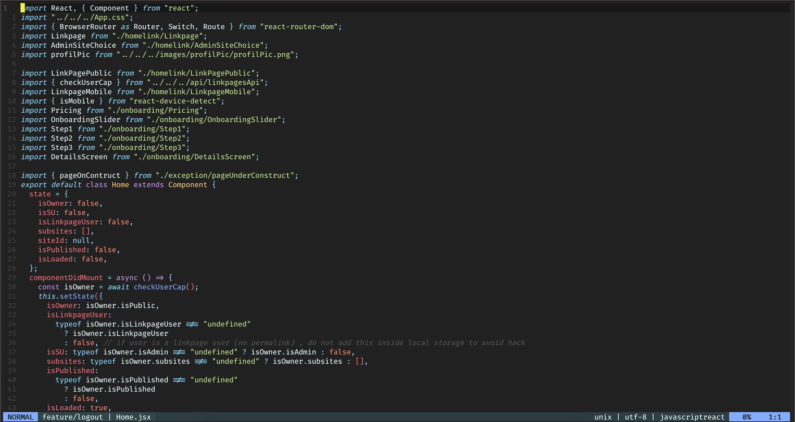

# Neovim for development

You can find in that repo all of my Neovim configs.

## Screenshot of how it looks

## How to install ?

1- Just put the nvim folder into your `~/.config` folder \
2- Then open neovim with `nvim` \
3- Install all plugins with `:PlugInstall` \
4- Then refresh your vim config with `:so %`
